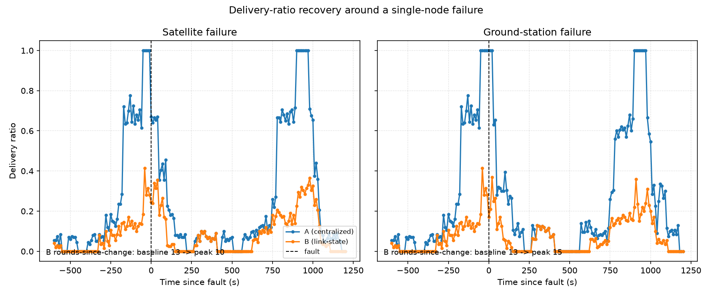

# Satellite Mesh Routing Simulator

A simulator for routing over a LEO satellite constellation. The interesting
part: a constellation's topology is deterministic -- you can compute exactly
where every satellite will be at any time -- but no single satellite has a
global view of the network. It still has to find routes using only what its
neighbors tell it.

This project builds a time-varying constellation (Walker-delta orbits, ~144
satellites + 6 ground stations) and runs two routers over it:

- **A (centralized)** -- recomputes global shortest paths every timestep
  with full knowledge of the graph. Not realistic, but it's a useful upper
  bound to compare against.
- **B (link-state)** -- each satellite only knows its own neighbors at
  first, floods link-state updates for a few rounds, and routes off
  whatever it's managed to learn. This is the "real" one, staleness and
  all.

The link-graph computation (checking every satellite pair for line-of-sight
and range) is O(n²) and gets slow fast, so there's also a C++/pybind11 port
of that hot path with a benchmark comparing it against naive and
numpy-vectorized Python.

## Example: recovering from a failure

Kill a satellite mid-run and both routers eventually recover, but not the
same way -- A reroutes the instant another satellite comes into view, while
B needs a few rounds of flooding before it catches up. More plots (routing
performance under normal conditions, and the C++ speedup) live in
`docs/architecture.md`.

## Setup

    pip install -r requirements.txt

    # optional: build the C++ extension (off by default, see Config.use_cpp)
    cd cpp_ext && cmake -B build && cmake --build build

## Running it

Run a simulation directly:

    from config import Config
    from sim.engine import run_simulation

    result = run_simulation(Config(), router="link_state")  # or "centralized"
    print(result.metrics)

`result.metrics` has the summary numbers (`delivery_ratio`, `mean_latency_s`,
`converged_step_frac`, ...). `result.per_step` has the same broken out per
timestep, and `result.packets` has the full per-packet log if you want to
dig into individual routes.

Run the tests:

    pytest tests/

Regenerate the plots:

    python benchmarks/benchmark_hotpath.py   # docs/benchmark_hotpath.png, benchmarks/results.csv
    python benchmarks/normal_operation.py    # docs/normal_operation.png
    python benchmarks/fault_recovery.py      # docs/fault_recovery.png
